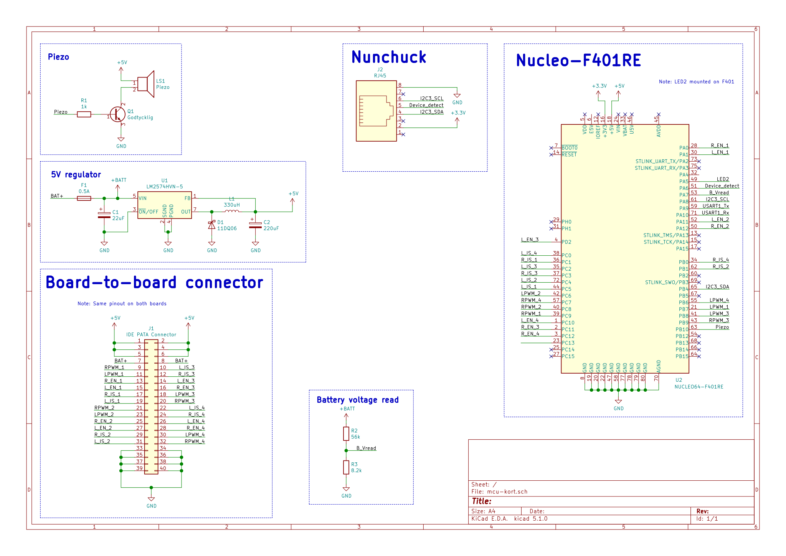

# Discosoffa
Repo för allt vad gäller den fabulösa Discosoffan!

# Index
[Modular BMS](#Modular-BMS)
[MCU-kort](#MCU-kort)

# Modular BMS
Det BMS (Battery Management System) vilket används på soffan är Jonathan Locks egendesignade Modular BMS-projekt. 
PCB-design, kod samt dokumentation för dessa finns att tillgå från hans .

Discosoffans batteripack är på 5-celler seriellt (5S). För detta behövs en modul per cell, varav en är master.

Följande är de konfigurationer Discosoffans BMS-moduler använder. Dessa anges i _config.h_.
```c
/** @brief Voltage which gives 100%-active discharge output [volt]
 * Voltages above this value will also keep the discharge output fully on */
#define VTHRS_DISCH_MAX_V				4.00

/** @brief Voltage which gives 0%-active discharge output [volt]
 * Voltages below this value will also keep the discharge output fully off */
#define VTHRS_DISCH_MIN_V				3.95

/** @brief Threshold voltage for activating the charge-disable output [volt] */
#define VTHRS_CHGDIS_START_V			4.05

/** @brief Threshold voltage for de-activating the charge-disable output [volt] */
#define VTHRS_CHGDIS_STOP_V				4.00

/** @brief Threshold voltage for triggering an undervoltage alarm [volt]
 * See also TMIN_UV_ALARM_S */
#define VTHRS_UV_ALARM_V				3.50

/** @brief Threshold voltage for triggering an overvoltage alarm [volt] */
#define VTHRS_OV_ALARM_V				4.10

/** @brief Voltage hysteresis for leaving alarm state [volt]
 * To leave the undervoltage alarm the sampled voltage must exceed
 * VTHRS_UV_ALARM_V + VHYST_ALARMS_V, and to leave the overvoltage
 * alarm the sampled voltage must be below
 * VTHRS_OV_ALARM_V - VHYST_ALARMS_V */
#define VHYST_ALARMS_V					0.05

/** @brief Minimum time the charger will be kept disabled after voltage exceeds
* VTHRS_CHGDIS_START_mv [seconds] */
#define TMIN_CHGDIS_S					30.0

/** @brief Minimum time voltage must be below VTHRS_UV_ALARM_V to trigger an
 * alarm [seconds] */
#define TMIN_UV_ALARM_S					60.0
```

# MCU-kort
Kortet vilket sköter styrningen av soffan. Denna huserar en Nucleo-F401RE dev board.



